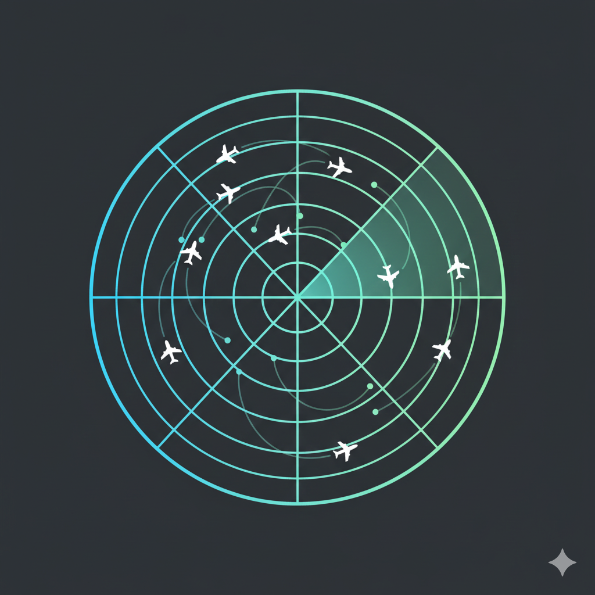

# AeroIntel

**Aviation Intelligence Platform** - Real-time flight conflict detection, hotspot analysis, and cost-optimized resolution proposals.



## 🚀 Features

- **Real-Time Conflict Detection** - Automatically identifies when aircraft get too close
- **Hotspot Analysis** - Pinpoints high-traffic congestion areas
- **Intelligent Proposals** - Generates multiple resolution options ranked by cost-effectiveness
- **3D Globe Visualization** - Interactive Mapbox globe showing all flights and trajectories
- **Live Data Tracking** - Auto-refresh with configurable intervals
- **Cost-Aware Recommendations** - Considers delay, fuel, and operational costs

## 🛠️ Built With

### Frontend
- **React 18.2.0** - UI framework
- **Vite 5.0** - Build tool & dev server
- **Mapbox GL JS 3.18.0** - 3D globe visualization
- **CSS3** - Custom styling

### Backend
- **Python 3** - Core language
- **FastAPI** - REST API framework
- **Uvicorn** - ASGI server
- **Pydantic** - Data validation & models

### Data Storage
- **JSON** - File-based storage (no database required)

## 📋 Prerequisites

- **Node.js** 18+ and npm
- **Python** 3.10+
- **Mapbox Access Token** - [Get one free here](https://account.mapbox.com/access-tokens/)

## 🚀 Getting Started

### 1. Clone the Repository

```bash
git clone https://github.com/Vrishab20/UottawaHack-8-AeroIntel.git
cd UottawaHack-8-AeroIntel
```

### 2. Backend Setup

```bash
cd backend
pip install -r requirements.txt
```

### 3. Frontend Setup

```bash
cd frontend
npm install
```

### 4. Configure Mapbox API Key

1. Get your free Mapbox access token from [https://account.mapbox.com/access-tokens/](https://account.mapbox.com/access-tokens/)
2. Open `frontend/src/components/GlobeView.jsx`
3. Replace `YOUR_MAPBOX_ACCESS_TOKEN_HERE` with your actual token:

```javascript
const MAPBOX_TOKEN = "pk.your_actual_token_here";
```

### 5. Start the Backend

```bash
cd backend
python -m uvicorn app.main:app --host 0.0.0.0 --port 8001 --reload
```

The API will be available at `http://localhost:8001`

### 6. Start the Frontend

```bash
cd frontend
npm run dev
```

The app will be available at `http://localhost:5173`

## 📁 Project Structure

```
NAV/
├── backend/
│   ├── app/
│   │   ├── main.py          # FastAPI application
│   │   ├── models.py        # Pydantic models
│   │   ├── conflicts.py     # Conflict detection logic
│   │   ├── hotspots.py       # Hotspot analysis
│   │   ├── resolver.py      # Proposal generation
│   │   ├── scoring.py       # Cost-benefit scoring
│   │   ├── trajectory.py   # Trajectory calculations
│   │   └── parsing.py      # Route parsing
│   └── requirements.txt
├── frontend/
│   ├── src/
│   │   ├── components/
│   │   │   ├── GlobeView.jsx      # 3D globe component
│   │   │   ├── ControlCenter.jsx # Main dashboard
│   │   │   ├── TopBar.jsx         # Navigation bar
│   │   │   └── ...
│   │   ├── App.jsx
│   │   └── styles.css
│   ├── public/
│   │   ├── logo.png
│   │   └── favicon.svg
│   └── package.json
└── canadian_flights_1000.json  # Sample flight data
```

## 🔌 API Endpoints

- `GET /load-data` - Load flight data from JSON file
- `POST /analyze` - Analyze flights for conflicts and hotspots
- `POST /apply` - Apply resolution proposals to flights
- `POST /save-data` - Save modified flight data back to JSON

## 🎯 Usage

1. **Load Data** - Flight data loads automatically on startup
2. **Analyze** - Click "Analyze Now" or enable "Auto Analyze"
3. **View Conflicts** - See detected conflicts with severity scores
4. **Review Proposals** - Click a conflict to see resolution options
5. **Preview Changes** - Hover over proposals to see trajectory changes
6. **Apply Solutions** - Click "Apply" to implement a proposal
7. **Compare Flights** - Use "Compare" to isolate specific flights on the globe

## 🔧 Configuration

### Refresh Intervals
- Configure auto-refresh in the Control Center (5s, 10s, 15s, 30s, 1m)
- Default: 15 seconds

### Conflict Thresholds
- Horizontal: 5.0 nautical miles
- Vertical: 2000 feet

Edit `backend/app/conflicts.py` to adjust thresholds.

## 📝 License

This project is released under the **MIT License**.

You are free to use, modify, and distribute this software for personal, academic, or commercial purposes, provided that the original copyright and license notice are included.

This project was developed as part of a hackathon and is intended for research, learning, and demonstration purposes.

---

## 👥 Contributors

- **Vrishab Prasanth Davey** — *Sole creator and developer*

This project was designed, implemented, and refined entirely as a solo effort, including system design, analysis logic, visualization, and user experience.


## 🙏 Acknowledgments

- Mapbox for globe visualization
- NAV Canada for aviation domain inspiration
- FlightRadar 24 for UI Inspiration
